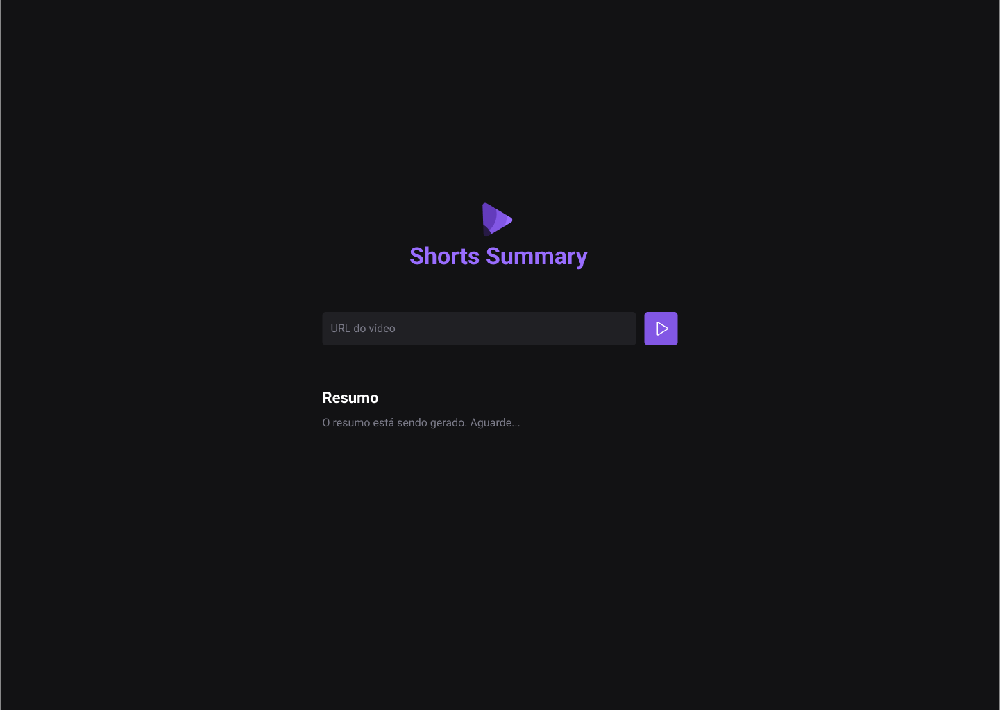

<h1 align="center"> Shorts Summary </h1>

<p align="center">
Aplicação que resume e cria descrições de vídeos do Youtube. <br/>

<p align="center">
  <a href="#-tecnologias">Tecnologias</a>&nbsp;&nbsp;&nbsp;|&nbsp;&nbsp;&nbsp;
  <a href="#-projeto">Projeto</a>&nbsp;&nbsp;&nbsp;|&nbsp;&nbsp;&nbsp;
  <a href="#-layout">Layout</a>&nbsp;&nbsp;&nbsp;|&nbsp;&nbsp;&nbsp;
  <a href="#-anotações">Anotações</a>&nbsp;&nbsp;&nbsp;|&nbsp;&nbsp;&nbsp;
</p>

<br>

<p align="center">
  
</p>

## 🚀 Tecnologias

Esse projeto foi desenvolvido com as seguintes tecnologias:

- HTML e CSS
- JavaScript
- Git e Github
- Transformers.js
- Bart.AI e Whisper.AI
- NodeJS

## 💻 Projeto

O Shorts é uma aplicação web que permite ao usuário realizar pequenos resumos ou descrições sobre vídeos shorts que podem ser encontrados no Youtube.

- [Acesse o projeto finalizado, online](https://lgustta13.github.io/shorts-summary/)

## 🔖 Layout

Acesse o Layout do projeto [aqui](<https://www.figma.com/file/8goMDWHGJOed9hFbnzbviG/Shorts-Summary-%E2%80%A2-Trilha-Foundations-(Community)?type=design&mode=design&t=S3MO19etkC8MjD4T-1>)

Acesse o Notion com informações da aplicação [aqui](https://efficient-sloth-d85.notion.site/NLW-13-IA-dc54c0a8b5c04d8198cef71627852d73)

## 📋 Anotações

### Tópicos

<ul>
<li><a href="#-conteudo">Conteúdo</a></li>
<li><a href="#-vite">Vite</a></li>
<li><a href="#-deploy">Deploy</a></li>
<li><a href="#-env">Variáveis de Ambiente</a></li>
<li><a href="#-backend">Backend</a></li>
<li><a href="#-ia">Inteligência Artificial</a></li>
</ul>

### Conteúdo

- web: pasta no qual se encontra a aplicação FrontEnd
- server: pasta que se encontra os serviços do BackEnd
- tmp: pasta temporária com o vídeo até a aplicação fazer a descrição

### Vite

Utilizado para criar o Front-end. Com o borderplate do Vite, é possível utilizar um template de projeto para inicializar o desenvolvimento. A princípio pede-se:

- Nome do projeto;
- Framework: Vanilla;
- Variant: JavaScript;

```Javascript
npm create vite@latest
npm install
npm run web
```

### Deploy

Para o Deploy da aplicação foi utilizado o Github Actions. Dessa forma, o arquivo de configuração se encontra na pasta .github, segundo a documentação do site [ViteJS](https://vitejs.dev/guide/static-deploy.html)

### Variáveis de ambiente

As variáveis de ambiente são acessadas dentro do arquivo .env, por meio do prefixo VITE conforme a [documentação](https://vitejs.dev/guide/env-and-mode.html):

- VITE\_: significa que a variável terá seu conteúdo visível no browser
- sem o prefixo: a variável não tem seu valor visível no browser

### Backend

Utilização do NodeJS para a criação do serviço web. Permitir a execução do JavaScript fora do navegador (quando inicia o servidor, as rotas criadas entendem o código JavaScript, resultando em um serviço)

```
GET https://localhost:3333/summary/7
<method> <protocol>://<address>:<port>/<resource>/<route params>
```

```
npm install express cors axios ytdl-core@4.10.0
```

A **ytdl** possibilita baixar vídeos do Youtube.
O **cors** possibilita que qualquer ou alguma origem específica consiga requisitar nas rotas do BackEnd.
O **express** é utilizado para criar as rotas das APIs.
O **axios** é utilizado para buscar uma rota, tanto no FrontEnd quanto no BackEnd.
O **fs** é utilizado para manipular arquivos armazenados nos diretórios, permite criar arquivos de dados de vídeo.

Para ficar observando as mudanças no servidor (não precisa reiniciar com mudanças no código)

```
 node --watch ./index.js  <!--versão >18.11-->
```

### Inteligência Artificial

- [Whisper](https://openai.com/research/whisper): ASR(Automatic Speech Recognition) modelo da OpenAI de reconhecimento de fala
- [Bart](https://www.width.ai/post/bart-text-summarization): modelo para resumo de textos
- [Transformer.js](https://huggingface.co/models): permite utilzar modelos de IA no navegador ou servidor com JavaScript

```
npm install @xenova/transformers fluent-ffmpeg ffmpeg-static node-wav
```

#### Transformer.js

```
npm install @xenova/transformers
```

O [Transformer](https://huggingface.co/docs/transformers/quicktour) é uma biblioteca que fornece API para utilizar, baixar ou treinar modelos pretreinados. Isso significa que não precisa criar ou treinar novos modelos, basta só escolher um que resolva o nosso problema.
A princípio, é utilizado com os Frameworks de ML PyTorch, TensorFlow e JAX, ou seja, Python. Porém existe a versão para web, o [Transformer.js](https://huggingface.co/docs/transformers.js/index). Os dois têm suas peculiaridades devido a linguagem, mas a ideia de uso é a mesma.
Para rodar os modelos, deve-se acessá-los pela API pipeline() no qual abstrai todo código complexo da biblioteca transformers, criando uma instância, apresentando a task e o modelo:

```
import {pipeline} from "@xenova/transformers"

let pipe = await pipeline('sentiment-analysis');
// (task="automatic-speech-recognition", model="Xenova/whisper-small")

let result = await pipe(dados)
```

Primeiro é alocado uma pipeline e depois utiliza o modelo. Os modelos que podem ser utilizados podem ser acessados por este [link](https://huggingface.co/models), vale tanto para o Python quanto para JavaScript no browser e no backend com Node.js.
Pode acontecer de demorar muito para dar uma resposta, mas isso é normal. Tem relação com a velocidade da Internet e o número de requisições no uso do modelo para vários usuários, o que pode gerar filas.
Dependendo do conteúdo no input, a IA pode não ter uma precisão boa.

#### Whisper

Dentre os modelos acessíveis pela API pipeline e dentro do HuggingFace, temos o [Whisper](https://huggingface.co/openai/whisper-small), utilizado para reconhecimento de fala automático.

#### Bart

Dentre os modelos acessíveis pela API pipeline e dentro do HuggingFace, temos o [Bart](https://huggingface.co/facebook/bart-large-cnn), utilizado para resumo de textos.

#### ffmpeg

O [ffmpeg](https://www.ffmpeg.org/ffmpeg.html#Synopsis) é um framework que consegue fazer decode, encode, stream, filtrar e tocar arquivos multimídia em diferentes formatos. Destinado para desenvolvedores, é um conversor de mídia universal

#### fluent-ffmpeg

A biblioteca é uma abstrção da CLI do ffmpeg para um módulo Node.js simples de utilizar. Existem muitos exemplos na [documentação](https://www.npmjs.com/package/fluent-ffmpeg) de inputs como vídeo ou áudio

#### ffmpeg-static

A função da biblioteca é fazer download de arquivos binários de quaisquer localização dentro do Windows, Linux e macOS

#### node-wav

Será utilizada para converter o conteúdo do vídeo de mp4 para wav, ou seja, gerar o áudio puro do vídeo conforme sua frequência
